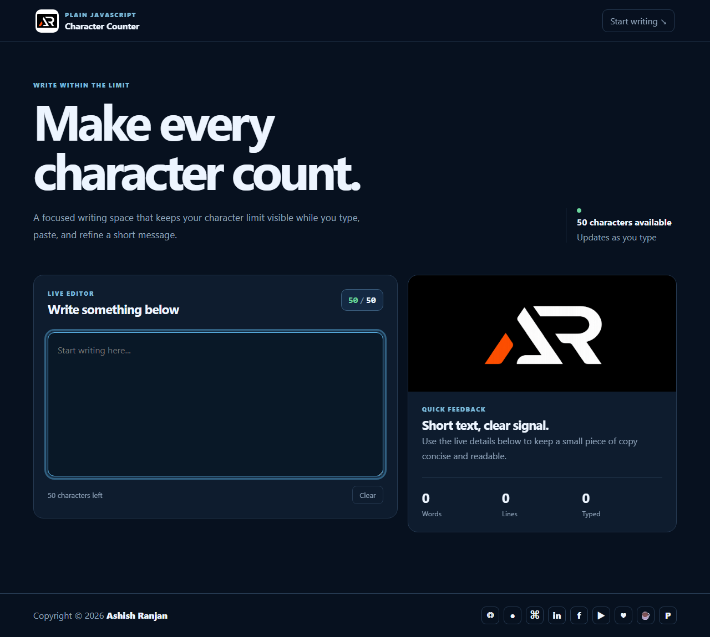

# Real Time Character Counter

A responsive plain JavaScript writing tool that keeps a 50-character limit visible while updating word, line, and character details as you type.

## Features

- Live character count with safe, caution, and warning states.
- Paste-friendly input handling with a clear button.
- Word, line, and typed-character statistics.
- Fixed responsive header, local branding, and icon-only footer links.
- Works as a static page without a build step.

## Tech stack

HTML, CSS, SCSS source, and plain JavaScript.

## Run locally

Open `index.html` in a browser or serve the folder with any static web server.

## Live

[Open the live project](https://a2rp.github.io/real_time_character_counter/)

## Links

- Portfolio: [https://www.ashishranjan.net](https://www.ashishranjan.net)
- GitHub: [https://github.com/a2rp](https://github.com/a2rp)
- CodePen: [https://codepen.io/ash1198](https://codepen.io/ash1198)
- LinkedIn: [https://www.linkedin.com/in/aashishranjan](https://www.linkedin.com/in/aashishranjan)
- Facebook: [https://www.facebook.com/theash.ashish/](https://www.facebook.com/theash.ashish/)
- YouTube: [https://www.youtube.com/@ashishranjan-ashz?sub_confirmation=1](https://www.youtube.com/@ashishranjan-ashz?sub_confirmation=1)
- Email: [ash.ranjan09@gmail.com](mailto:ash.ranjan09@gmail.com)

## Support

- Support: [https://a2rp-donation-page.netlify.app/](https://a2rp-donation-page.netlify.app/)
- Buy Me a Coffee: [https://buymeacoffee.com/a2rp](https://buymeacoffee.com/a2rp)
- Patreon: [https://patreon.com/a2rp](https://patreon.com/a2rp)
